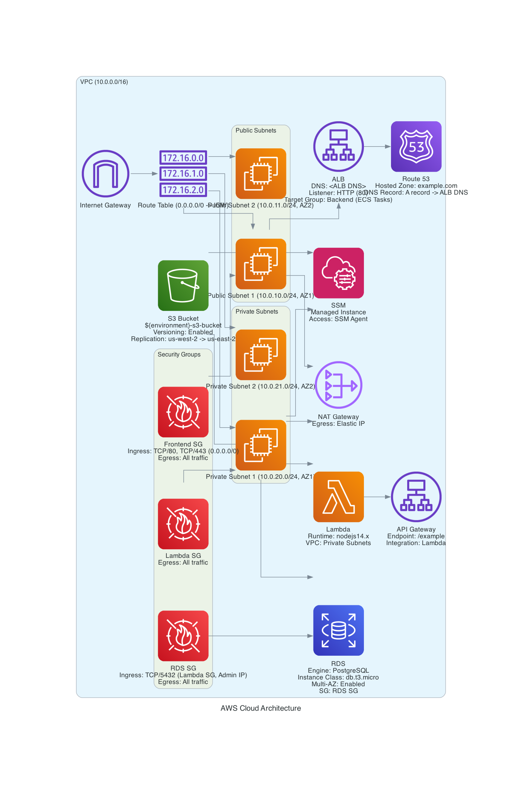

# Proyecto Terraform para AWS

## Requisitos

- Terraform v0.12+
- AWS CLI configurado

## Configuración

### 1. Configurar Credenciales de AWS

Edita el archivo `~/.aws/credentials`:

```plaintext
[default]
aws_access_key_id = YOUR_ACCESS_KEY_ID
aws_secret_access_key = YOUR_SECRET_ACCESS_KEY

[development]
aws_access_key_id = YOUR_DEV_ACCESS_KEY_ID
aws_secret_access_key = YOUR_DEV_SECRET_ACCESS_KEY

[production]
aws_access_key_id = YOUR_PROD_ACCESS_KEY_ID
aws_secret_access_key = YOUR_PROD_SECRET_ACCESS_KEY
```


Edita el archivo `~/.aws/config`:

```plaintext
[default]
region = us-east-1
output = json

[profile development]
region = us-east-1
output = json

[profile production]
region = us-west-2
output = json
```
# Diagrama de Arquitectura
 

## Descripción Visual de la Arquitectura

La infraestructura está diseñada para ser altamente disponible, segura y resiliente, distribuyendo componentes críticos en múltiples zonas de disponibilidad (AZ) y regiones para asegurar la continuidad del servicio.

### AWS Cloud

#### VPC Principal (10.0.0.0/16)
- **Internet Gateway**
- **Route Table**: Asociada con el Internet Gateway para enrutar tráfico a 0.0.0.0/0

#### Subredes Públicas
- **Public Subnet 1** (AZ1, 10.0.10.0/24)
- **Public Subnet 2** (AZ2, 10.0.11.0/24)

#### Subredes Privadas
- **Private Subnet 1** (AZ1, 10.0.20.0/24)
- **Private Subnet 2** (AZ2, 10.0.21.0/24)

#### Security Groups
- **Frontend Security Group**: Permitir TCP/80 y TCP/443 desde cualquier IP
- **Lambda Security Group**: Permitir todo el tráfico saliente
- **RDS Security Group**: Permitir TCP/5432 desde el Lambda SG y una IP administrativa específica

#### ALB
- Listener HTTP en el puerto 80
- Target Group configurado para enrutar tráfico HTTP a las instancias backend (ECS Tasks)

#### Route 53
- **Hosted Zone**: example.com
- **DNS Record**: Registro A apuntando al DNS del ALB

#### S3
- **Bucket**: ${environment}-s3-bucket
- **Versioning** habilitado

#### RDS
- **Engine**: PostgreSQL
- **Instance Class**: db.t3.micro
- **Multi-AZ** habilitado
- No accesible públicamente

#### Bastion Host (WIP)
- En una subred pública para permitir el acceso SSH seguro a las instancias en subredes privadas

### Conexiones Entre Componentes
- **ALB a Frontend Instances**: El ALB distribuye el tráfico entrante en los puertos 80/443 a las instancias frontend en las subredes públicas.
- **Frontend Instances a Backend Lambda**: Las instancias frontend invocan las funciones Lambda mediante APIs configuradas.
- **Lambda a RDS**: Las funciones Lambda se comunican con RDS en las subredes privadas usando el RDS Security Group.
- **Bastion Host a RDS**: El bastion host permite el acceso seguro a las instancias RDS en las subredes privadas.

## Documentación y Explicación de la Arquitectura

### 1. Alta Disponibilidad (High Availability)

#### Frontend y Backend:
- **Elastic Load Balancer (ALB)**: Distribuye el tráfico entre instancias de frontend en múltiples zonas de disponibilidad, asegurando que la falla de una AZ no afecte el servicio.
- **AWS Lambda**: Las funciones Lambda se ejecutan automáticamente en múltiples AZs, proporcionando alta disponibilidad.

#### Database:
- **RDS Multi-AZ**: La configuración Multi-AZ de RDS replica automáticamente la base de datos en una zona de disponibilidad secundaria, permitiendo conmutación por error en caso de fallo.

### 2. Recuperación Ante Desastres

#### Configuración Multi-Region:
- **RDS Read Replica**: Configuración de réplicas de lectura en una región secundaria para recuperación ante desastres.
- **S3 Cross-Region Replication**: Replicación de objetos S3 entre regiones para asegurar la disponibilidad de los datos.
- **Route 53 DNS Failover**: Configuración de Route 53 para gestionar el failover entre regiones.
- **Terraform Scripts**: Scripts para desplegar infraestructura en una región secundaria de forma semi-automatizada.

### 3. Proceso Semi-Automatizado para el Cambio de Región
- **AWS CloudWatch**: Monitorea el estado de la infraestructura y dispara alertas en caso de falla.
- **AWS Lambda + Step Functions**: Crear una función Lambda y un flujo de trabajo de Step Functions que puede ser invocado para realizar el cambio de región.

### 4. Segmentación de Redes
- **Subredes Públicas y Privadas**: Las subredes públicas se utilizan para los componentes que necesitan acceso a Internet (frontend y bastion host), mientras que las subredes privadas se utilizan para los componentes internos y críticos (backend y RDS).

### 5. Protección Mediante Firewalls
- **Security Groups y NACLs**: Configuración de grupos de seguridad y listas de control de acceso de red para segmentar y proteger las subredes y controlar el tráfico entrante y saliente.

### 6. Restricciones de Conexiones Entrantes y Salientes
- **Security Groups**: Configuración de reglas de seguris
- **Bastion Host**: Configuración de unaccedan a Internet sin exponer sus IPs.
- **WAF (Web Application Firewall)**: Para proteger las aplicaciones web de ataques comunes.
- **CloudFront**: Para distribución de contenido con baja latencia y alta velocidad.
- **Secrets Manager**: Para almacenar y rotar secretos y credenciales de forma segura.
- **Config Rules y Security Hub**: Para monitorizar el cumplimiento y 